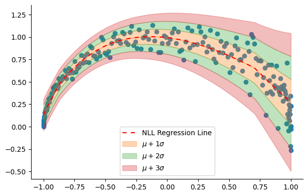
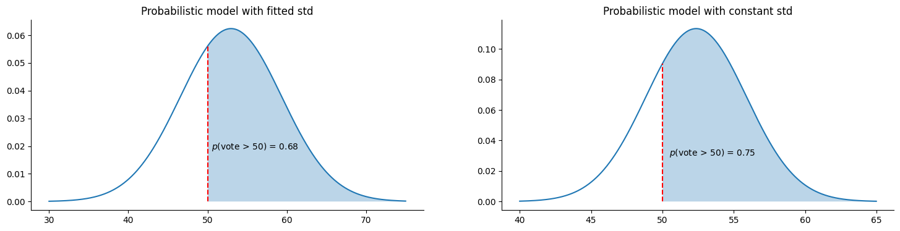

+++
title = 'Fitting probabilistic neural networks for regression'
author = 'Amine Sehili'
publishDate = '2024-02-04T23:04:02'
draft = false
+++

In the [first article](https://amsehili.github.io/posts/pdl/mle-for-regression-problems) of this series, we discussed the use of NLL (Negative Log-Likelihood) as a loss function in the context of linear regression. We particularly showed that, under the assumptions of linear regression, NLL can be used to find the mean of the normal distribution that generates that data, achieving the same model as with MSE (Mean Squared Error).

When the data is linear and has a constant variance (**homoscedasticity**) that is independent of the independent variable $x$, linear models are  generally suitable. However, when either or both of these conditions—linearity and constant variance—are not met, a linear model may underfit the data. In such cases, it's often more convenient to relax these strict assumptions and consider more sophisticated models that can more accurately capture the distribution of the data. This will the focus of this second article.


## Relaxing the assumption about the constant variance of the residuals
In many datasets, the variance of the residuals is not constant but changes as a function of the independent variable. This phenomenon is known as **heteroscedasticity**.

The following figure depicts data where the variance of the residuals increases as a function of $x$. As observed, with the increase in $x$, the target values $y$ are more dispersed from the regression line. This implies that the range of potential values for $y$ widens, making the predicted value $\hat{y}$, which represents the model's best estimate, less reliable.


{}
```python
import numpy as np
import matplotlib.pyplot as plt
from sklearn.linear_model import LinearRegression

# Generate synthetic data
N = 40
np.random.seed(1234)
X = np.random.rand(N, 1) * 10
X = X[np.argsort(X.squeeze())]

var = np.linspace(0.0, 10, N)
y = 2 * X.reshape(-1) + 1 + np.random.randn(N) * var

X = X.astype(np.float32)
y = y.astype(np.float32)


# Fit a linear regression model
lin_model = LinearRegression()
lin_model.fit(X, y)

# Predictions using the model
y_hat = lin_model.predict(X)

# Draw data points and regression line
plt.scatter(X, y, alpha=0.7)
plt.plot(X, y_hat, c="#800080", lw=2)

# Draw lines between data points and the regression line
for i in range(len(X)):
    plt.plot(
        [X[i], X[i]],
        [y[i], y_hat[i]],
        c="red",
        ls="--",
        lw=1,
    )

plt.xlabel("X")
plt.ylabel("y")
plt.title("Linear regression with data points and residuals")
```
{}

    

    

In the case of a non-probabilistic model that is fitted using MSE, we lack a mechanism to assess the uncertainty of its predictions, implicitly treating all predictions as equally probable for any given value of the input $x$. On the other hand, with a probabilistic model, we can select a distribution that we believe accurately represents the data. The model is then tasked with predicting the parameters of this distribution for each input. By using the NLL as the loss function, we can effectively optimize the model to account for the uncertainty in its predictions.

In the [previous article](https://amsehili.github.io/posts/pdl/mle-for-regression-problems), we employed NLL to fit the mean of the Gaussian distribution representing the data. However, we did not estimate the other key parameter of the distribution, the standard deviation (std), under the assumption that the std of the residuals is constant across the data. We demonstrated that under this assumption, fitting a model using NLL is effectively equivalent to using MSE, as both methods aim to minimize the discrepancies between observed and predicted values.

In this second article, we'll use NLL to fit both parameters of the Gaussian distribution (mean and standard deviation) to obtain a truly probabilistic model. This approach will allows us to evaluate the uncertainty of the model's outputs. The steps to fit a probabilistic model include:

- Selecting a distribution family, which we assume represents the target variable $y$.
- Building a model, typically a neural network, that outputs the **parameters** $\theta$ of the chosen distribution for each input $x$. This model predicts the distribution parameters $\theta$ instead of directly predicting the target value $y$.
- Using a loss function, typically NLL, to tune the model's parameters. This optimizes the model to maximize the likelihood of observing the target variable $y$ given the input $x$ and the distribution's parameters $\theta$."

At this point, you may wonder: if the model predicts the parameters of a distribution, how do we obtain the final value $\hat{y}$? This value is typically the mean of the distribution, which is what the model was trained to predict in the previous article. Unlike a non-probabilistic model, we now have a method to compute the likelihood of this mean (as well as any other possible values) and assess the uncertainty associated with the model's predictions.

## Creating a model that predicts all the parameters of a Gaussian distribution
In the following, we construct a simple linear model designed to predict the two parameters of the Gaussian distribution: the mean and the standard deviation (std). More specifically, the model outputs the mean and the logarithm of the standard deviation. We then apply the exponential function to the latter to ensure that the standard deviation is always positive. This approach, although based on a linear model, enables us to fit data with a non-constant standard deviation, potentially achieving a better NLL (Negative Log-Likelihood) than a model that predicts only the mean.

Note that in the following code, and in contrast to the first article, we are not defining a `proba_normal` function followed by an `NLL` function that calls `proba_normal` and returns the negative log of the result. Instead, our `NLL` function now directly implements the negative of the log of the Gaussian distribution function.



{}
```python
# pytorch
import torch
import torch.nn as nn
from torch.optim import Adam


def NLL(y, mu, sigma=1):
    a = -torch.log(sigma * torch.sqrt(torch.tensor(2 * torch.pi, dtype=torch.float64)))
    b = (y - mu) ** 2 / (2 * sigma**2)
    return -(a - b).mean()


def train_model(X, y, model, optimizer, loss_fn, n_epochs=1, log_at=0):
    for epoch in range(1, n_epochs + 1):
        y_hat = model(X)  # y_hat is mu
        mu = y_hat[:, 0]
        log_sigma = y_hat[:, 1]
        sigma = torch.exp(log_sigma)
        loss = loss_fn(y, mu, sigma)
        optimizer.zero_grad()
        loss.backward()
        optimizer.step()
        if log_at <= 0:
            continue
        if epoch % log_at == 0:
            print(f"Epoch {epoch}, loss: {loss.item():.4f}")


def predict(X, model):
    with torch.no_grad():
        return model(X)
```
{}

{}
```python
# tensorflow
import tensorflow as tf
from tensorflow import keras
from tensorflow.keras import backend as K
from tensorflow.keras import layers as tfkl


def NLL(y, theta):
    mu, log_sigma = tf.split(theta, 2, axis=1)
    mu, log_sigma = theta[:, 0], theta[:, 1]
    sigma = tf.exp(log_sigma)
    y = tf.squeeze(y)
    a = -tf.math.log(sigma * tf.sqrt(tf.cast(2 * np.pi, "float64")))
    b = (y - mu) ** 2 / (2 * sigma**2)
    return -tf.reduce_mean((a - b))
```
{}


Then we initialize and fit our model:


{}
```python
# pytorch
model = nn.Linear(in_features=1, out_features=2, dtype=torch.float64)
optimizer = Adam(model.parameters(), lr=0.01)
X_t = torch.tensor(X, dtype=torch.float64)
y_t = torch.tensor(y, dtype=torch.float64)
```
{}

{}
```python
# tensorflow
K.set_floatx("float64")
model = keras.Sequential([tfkl.Dense(2)])
optimizer = keras.optimizers.Adam(learning_rate=0.01)
model.compile(optimizer=optimizer, loss=NLL)
```
{}



{}
```python
train_model(X_t, y_t, model, optimizer, NLL, n_epochs=1500, log_at=150)
```
{}

{}
```python
# tensorflow
model.fit(X, y, epochs=1500)
```
{}


    Epoch 150, loss: 3.6933
    Epoch 300, loss: 3.2984
    Epoch 450, loss: 2.9245
    Epoch 600, loss: 2.8238
    Epoch 750, loss: 2.8009
    Epoch 900, loss: 2.7838
    Epoch 1050, loss: 2.7717
    Epoch 1200, loss: 2.7640
    Epoch 1350, loss: 2.7595
    Epoch 1500, loss: 2.7568

## Analyzing our model
Let's first apply prediction on the training data to compare our NLL-optimized model with the MSE-optimized model obtained using scikit-learn above. We will also focus on visualizing the std learned by the model, as it is our primary point of interest. The subsequent figure illustrates the regression lines of both models, alongside the data ranges covered by 1x, 2x, and 3x the magnitude of the learned std.



{}

```python
# pytorch
theta = predict(X_t, model).numpy()
```
{}

{}
```python
# tensorflow
theta = model.predict(X)
```

{}


```python
mu = theta[:, 0]
sigma = np.exp(theta[:, 1])

plt.scatter(X, y, alpha=0.9)
plt.plot(X, y_hat, lw=2, c="#660066", label="MSE Regression Line")
plot_regression_line_with_std(X.squeeze(), mu, sigma)

plt.xlabel("X")
plt.ylabel("y")
plt.legend(loc="upper left")
```
    

    

It appears that the regression lines of the two models are slightly different. More importantly, the learned standard deviation seems to align well with the spread of the data and varies as a function of the input $x$. This raises the question: does this make the NLL-optimized model better than the MSE-optimized one? To answer this question, we generate some validation data and compute the validation loss for each model to make a more informed comparison.


```python
N = 4000
X_val = np.random.rand(N, 1) * 10
X_val = X_val[np.argsort(X_val.squeeze())]

var = np.linspace(0.0, 10, N)
y_val = 2 * X_val.reshape(-1) + 1 + np.random.randn(N) * var
```

### Validation loss of the NLL-optimized model 


{}
```python
# pytorch
theta = predict(torch.tensor(X_val), model).numpy()
```
{}

{}
```python
# tensorflow
theta = model.predict(X_val)
```
{}


The following code constructs a normal distribution (using scipy) for each data point based on the mean and standard deviation predicted by the model. It then computes the average NLL of all points. Furthermore, for purposes of comparison, we also calculate the validation MSE of the model.


```python
from scipy.stats import norm

mu = theta[:, 0]  # this is also y_hat, the model's best guess
sigma = np.exp(theta[:, 1])

dist = norm(mu, sigma)
nll_nn = -np.log(dist.pdf(y_val)).mean()
mse_nn = ((mu - y_val) ** 2).mean()

print(f"NLL: {nll_nn:.4}", f"MSE: {mse_nn:.4}")
```

    NLL: 2.971 MSE: 32.56

### Validation loss of the MSE-optimized model
Given that this model doesn't predict the standard deviation of the data, we can calculate the std of the residuals as an alternative for use in computing the NLL of all validation points. However, in the subsequent code block, we will calculate the NLL for std values ranging from 1 to 10 (increasing by 0.1) and pick the lowest NLL.


```python
mu = lin_model.predict(X_val)

nll_lin = np.inf
best_sigma = None

for sigma_res in np.arange(1, 10.1, 0.1):
    dist = norm(mu, sigma_res)
    nll = -np.log(dist.pdf(y_val)).mean()
    if nll < nll_lin:
        nll_lin = nll

mse_lin = ((mu - y_val) ** 2).mean()
print(f"NLL: {nll_lin:.4}", f"MSE: {mse_lin:.4}")
```

    NLL: 3.176 MSE: 33.56


We can observe that the NLL-optimized model outperforms the MSE-optimized one when considering both loss metrics. Furthermore, this model enables us to compute the probability density of the predicted target values, thereby allowing us to quantify the uncertainty associated with each prediction. We will delve deeper into this aspect in the final part of the article. In the next section, we'll move beyond the assumption of data linearity and fit our first probabilistic non-linear regression model.

## Relaxing the assumption about the linearity of the data
Dealing with non-linear data in regression problems is a very common in practice. One effective strategy to address this using neural networks involves employing non-linear activation functions. Additionally, depending on the complexity of the data, enhancing the network's representation capacity by adding more layers and increasing the number of parameters within these layers can be beneficial. In the following section, we will generate some non-linear data then construct a neural network with two layers and a non-linear activation and fit it on the generated data.

{}
```python
from sklearn.datasets import make_moons

# Generate a moon-shaped dataset
N = 400
X, labels = make_moons(n_samples=N, noise=0.0, random_state=1)

# Use the first feature as independent variable
X, y = X[labels == 0, 0], X[labels == 0, 1]
X = X[:, None]
argsort = np.argsort(X.reshape(-1))
X = X[argsort]
y = y[argsort]
variance = np.linspace(0.0, 1, len(y))
y += np.random.randn(len(y)) * variance * 0.2

plt.scatter(X, y, alpha=0.7)
plt.xlabel("X")
plt.ylabel("y")
plt.show()
```
{}


    

    



{}
```python
# pytorch
model = nn.Sequential(
    nn.Linear(1, 16, dtype=torch.float64),
    nn.SELU(),
    nn.Linear(16, 2, dtype=torch.float64),
)

optimizer = Adam(model.parameters(), lr=0.01)
X_t = torch.tensor(X, dtype=torch.float64)
y_t = torch.tensor(y, dtype=torch.float64)
```
{}

{}
```python
# tensorflow
model = keras.Sequential(
    [tfkl.Dense(16, activation="selu"),
    tfkl.Dense(2)],
)

K.set_floatx("float64")
optimizer = tf.keras.optimizers.Adam(learning_rate=0.01)
model.compile(optimizer=optimizer, loss=NLL)
```
{}




{}
```python
# pytorch
train_model(X_t, y_t, model, optimizer, NLL, n_epochs=1000, log_at=100)
```
{}

{}
```python
# tensorflow
model.fit(X, y, epochs=1000)
```
{}



    Epoch 100, loss: 0.1186
    Epoch 200, loss: -0.2046
    Epoch 300, loss: -0.6314
    Epoch 400, loss: -0.7417
    Epoch 500, loss: -0.7756
    Epoch 600, loss: -0.8026
    Epoch 700, loss: -0.8178
    Epoch 800, loss: -0.8276
    Epoch 900, loss: -0.8360
    Epoch 1000, loss: -0.8441



{}

```python
# pytorch
theta = predict(torch.tensor(X), model).numpy()
```
{}

{}
```python
# tensorflow
theta = model.predict(X)
```
{}


The figure below displays the regression line produced by the model along with the varying standard deviation that it has learned.


```python
mu = theta[:, 0]
sigma = np.exp(theta[:, 1])

plt.scatter(X, y, alpha=0.9)
plot_regression_line_with_std(X.squeeze(), mu, sigma)
plt.legend(loc="lower center")
```
    

    

# A Practical example: forecasting the next US president using economic growth

In this section, we use data collected by political scientist Douglas Hibbs, as featured in the book *Regression and Other Stories* by Gelman, Hill, and Vehtari. The dataset is accessible for download from the book's [official repository](https://github.com/avehtari/ROS-Examples).

Hibbs developed a model known as "Bread and Peace" to forecast election outcomes based on economic growth, with adjustments made for wartime conditions. The data is presented in the table below, where `vote` represents the incumbent party's vote percentage, and `growth` denotes the average personal income growth during the years leading up to the vote.


```python
import pandas as pd

data = pd.read_csv("data/hibbs.dat", delimiter=" ")
data
```


<div>
<style scoped>
    .dataframe tbody tr th:only-of-type {
        vertical-align: middle;
    }

    .dataframe tbody tr th {
        vertical-align: top;
    }

    .dataframe thead th {
        text-align: left;
    }
    .dataframe tbody tr td {

        text-align: left;

    }
</style>
<table border="1" class="dataframe">
  <thead>
    <tr style="text-align: left;">
      <th>year</th>
      <th>growth</th>
      <th>vote</th>
      <th>inc_party_candidate</th>
      <th>other_candidate</th>
    </tr>
  </thead>
  <tbody>
    <tr>
      <td>1952</td>
      <td>2.40</td>
      <td>44.60</td>
      <td>Stevenson</td>
      <td>Eisenhower</td>
    </tr>
    <tr>
      <td>1956</td>
      <td>2.89</td>
      <td>57.76</td>
      <td>Eisenhower</td>
      <td>Stevenson</td>
    </tr>
    <tr>
      <td>1960</td>
      <td>0.85</td>
      <td>49.91</td>
      <td>Nixon</td>
      <td>Kennedy</td>
    </tr>
    <tr>
      <td>1964</td>
      <td>4.21</td>
      <td>61.34</td>
      <td>Johnson</td>
      <td>Goldwater</td>
    </tr>
    <tr>
      <td>1968</td>
      <td>3.02</td>
      <td>49.60</td>
      <td>Humphrey</td>
      <td>Nixon</td>
    </tr>
    <tr>
      <td>1972</td>
      <td>3.62</td>
      <td>61.79</td>
      <td>Nixon</td>
      <td>McGovern</td>
    </tr>
    <tr>
      <td>1976</td>
      <td>1.08</td>
      <td>48.95</td>
      <td>Ford</td>
      <td>Carter</td>
    </tr>
    <tr>
      <td>1980</td>
      <td>-0.39</td>
      <td>44.70</td>
      <td>Carter</td>
      <td>Reagan</td>
    </tr>
    <tr>
      <td>1984</td>
      <td>3.86</td>
      <td>59.17</td>
      <td>Reagan</td>
      <td>Mondale</td>
    </tr>
    <tr>
      <td>1988</td>
      <td>2.27</td>
      <td>53.94</td>
      <td>Bush, Sr.</td>
      <td>Dukakis</td>
    </tr>
    <tr>
      <td>1992</td>
      <td>0.38</td>
      <td>46.55</td>
      <td>Bush, Sr.</td>
      <td>Clinton</td>
    </tr>
    <tr>
      <td>1996</td>
      <td>1.04</td>
      <td>54.74</td>
      <td>Clinton</td>
      <td>Dole</td>
    </tr>
    <tr>
      <td>2000</td>
      <td>2.36</td>
      <td>50.27</td>
      <td>Gore</td>
      <td>Bush, Jr.</td>
    </tr>
    <tr>
      <td>2004</td>
      <td>1.72</td>
      <td>51.24</td>
      <td>Bush, Jr.</td>
      <td>Kerry</td>
    </tr>
    <tr>
      <td>2008</td>
      <td>0.10</td>
      <td>46.32</td>
      <td>McCain</td>
      <td>Obama</td>
    </tr>
    <tr>
      <td>2012</td>
      <td>0.95</td>
      <td>52.00</td>
      <td>Obama</td>
      <td>Romney</td>
    </tr>
  </tbody>
</table>
</div>


The figure below displays the dataset along with the linear model developed by Hibbs:

{}
```python
X = data["growth"].to_numpy()[:, None].astype(np.float32)
y = data["vote"].to_numpy().astype(np.float32)

argsort = np.argsort(X.reshape(-1))
X = X[argsort]
y = y[argsort]

lin_model = LinearRegression().fit(X, y)
y_hat = lin_model.predict(X)

plt.scatter(X, y, alpha=0.8)
plt.plot(
    X,
    y_hat,
    lw=2,
    c="#660066",
)
```
{}
   

    


## A probabilistic model for Hibbs' data
We will construct a probabilistic neural network to model Hibbs' data. Leveraging on the flexibility of neural networks, we will make a slightly different architectural choice for our model compared to the previous one. We will employ a linear branch of the network to predict the mean of the distribution (representing the model's best guess), and a non-linear branch to predict the standard deviation, allowing our model to adapt to the varying spread of data points across different values of $x$.



{}
```python
# pytorch
class ProbModel(nn.Module):
    def __init__(self, n_units=64):
        super().__init__()
        self.hidden = nn.Linear(1, n_units)
        self.mu_output = nn.Linear(n_units, 1)
        self.log_sigma_activation = nn.SELU()
        self.log_sigma_output = nn.Linear(64, 1)

    def forward(self, X):
        out = self.hidden(X)
        mu = self.mu_output(out)
        log_sigma = self.log_sigma_output(self.log_sigma_activation(out))
        return torch.stack([mu, log_sigma], axis=1).squeeze()

    def predict(self, X):
        X = torch.tensor(X)
        with torch.no_grad():
            return self(X).numpy()
```
{}

{}
```python
# tensorflow
class ProbModel(keras.Model):
    def __init__(self, n_units=64, **kwargs):
        super().__init__(**kwargs)
        self.hidden = tfkl.Dense(n_units)
        self.mu_output = tfkl.Dense(1)
        self.log_sigma_activation = keras.activations.get("selu")
        self.log_sigma_output = tfkl.Dense(1)

    def call(self, X):
        out = self.hidden(X)
        mu = self.mu_output(out)
        log_sigma = self.log_sigma_output(self.log_sigma_activation(out))
        return tf.squeeze((tf.stack([mu, log_sigma], axis=1)))
```
{}




{}
```python
# pytorch
model = ProbModel()
optimizer = Adam(model.parameters(), lr=0.01)
X_t = torch.tensor(X, dtype=torch.float32)
y_t = torch.tensor(y, dtype=torch.float32)
```
{}

{}
```python
# tensorflow
model = ProbModel()
K.set_floatx("float64")
optimizer = tf.keras.optimizers.Adam(learning_rate=0.01)
model.compile(optimizer=optimizer, loss=NLL)
```
{}



{}
```python
# pytorch
train_model(X_t, y_t, model, optimizer, NLL, n_epochs=4000, log_at=400)
```
{}

{}
```python
# tensorflow
model.fit(X, y, epochs=1000)
```
{}


    Epoch 400, loss: 5.3124
    Epoch 800, loss: 5.1888
    Epoch 1200, loss: 4.6035
    Epoch 1600, loss: 3.9734
    Epoch 2000, loss: 3.4727
    Epoch 2400, loss: 2.5117
    Epoch 2800, loss: 2.4196
    Epoch 3200, loss: 2.2628
    Epoch 3600, loss: 2.1138
    Epoch 4000, loss: 2.2820


## Analyzing our model
Let's begin by plotting the obtained model:


```python
theta = model.predict(X)
mu = theta[:, 0]
sigma = np.exp(theta[:, 1])

plt.scatter(X, y, alpha=0.9)
plt.plot(X, y_hat, lw=2, c="#660066", label="MSE Regression Line")
plot_regression_line_with_std(X.squeeze(), mu, sigma)
plt.legend(loc="upper left")
```
   

    

The model effectively captures the varying spread of the data, with the highest level of uncertainty occurring within the growth interval between 2 and 3. Consequently, it is advisable to approach predictions made by the model (represented by the red dashed line, indicating the mean of the distribution) with caution. This observation aligns with our intuition after analyzing the data, indicating that relying solely on growth as a feature may not be sufficient for predicting voting outcomes, and additional features may be necessary.

Now, let's visualize the obtained distributions at four different growth levels: 0, 1, 2, and 4. Notably, the distributions appear narrower at very low and very high growth levels:

{}
```python
selected_X = np.array([[0], [1], [2], [4]], dtype=np.float32)

theta = model.predict(np.array(selected_X))

mu = theta[:, 0]
selected_y = mu
sigma = np.exp(theta[:, 1])

fig, ax = plt.subplots()
plt.scatter(X, y, label="Data Points", alpha=0.8)
plt.plot(
    selected_X,
    mu,
    linestyle="--",
    c="#ff0000",
    label="NLL Regression Line",
)

support = np.linspace(-11.5, 11.5, 100)
for xpos, ypos, std in zip(selected_X.reshape(-1), mu, sigma):
    draw_gaussian_at(
        support,
        std=std,
        height=1,
        xpos=xpos,
        ypos=ypos,
        ax=ax,
        c="k",
    )

plt.xlim(-0.1, 5.5)
plt.ylim(40, 70)


plt.xlabel("Growth")
plt.ylabel("Vote")
```
{}
    

    


We can use these distributions to calculate the probability density of the model's best estimate (the mean of the distribution) at these specific points:

{}
```python
mu = theta[:, 0]
sigma = np.exp(theta[:, 1])
dist = norm(mu, sigma)
prob = dist.pdf(mu)
plt.bar(np.arange(4), prob, width=0.3)
plt.xticks(np.arange(4), selected_X.squeeze())

plt.xlabel("Growth")
plt.ylabel("Probability of the forecasted vote")
```
{}
    

    


We can see that the model is much less certain about its predictions for growth values equal to 1 and 2, suggesting that we should be careful when using these predictions and that other (unknown) variables are required to determine the outcome of the voting outcome.

## Getting the most out of the model
While obtaining the model's best estimate and evaluating its uncertainty is valuable, there is room for improvement in this specific dataset and problem. Instead of solely predicting the incumbent party's candidate's vote share, we can calculate the probability of that candidate winning the election, defined as receiving more than 50% of the votes. This can be achieved by computing the [Cumulative Distribution Function](https://en.wikipedia.org/wiki/Cumulative_distribution_function) (CDF) for a vote share equal to 50 (i.e., the probability that a value is less than 50 in the given distribution) and subtracting it from 1:

$$p(vote > 50) =  1 - p(vote <= 50) = 1 - CDF(50)$$.

Now, let's examine the 2016 vote, which was between Hillary Clinton (the candidate of the incumbent party) and Donald Trump. The economic growth in the period preceding the vote was approximately 2.0 (this data point was not part of the training dataset). According to the probabilistic model, Clinton is predicted to receive a vote share of 52.96%—this value may be different, depending on the obtained model— while the non-probabilistic model predicts a vote share of 52.37%


```python
growth = np.array([[2]], dtype=np.float32)
print(f"Prob. model: {model.predict(growth)[0]:.2f}")
print(f"Non-prob. model: {lin_model.predict(growth)[0]:.2f}")
```

    Prob. model: 52.96
    Non-prob. model: 52.37


We define a helper function to calculate and visualize the probability of winning, $p(vote > 50)$, based on each model's predictions. For the non-probabilistic model, we use the standard deviation of the residuals from the training data.

{}
```python
def plot_dist_and_proba(dist, start, end, value, fontsize=10):
    xval = np.arange(start, end, 0.01)
    prob = dist.pdf(xval)
    mask = xval > value

    plt.plot(xval, prob)
    plt.plot(
        [value, value],
        [0, dist.pdf(value)],
        ls="--",
        c="red",
    )
    plt.fill_between(
        xval[mask],
        np.zeros(mask.sum()),
        prob[mask],
        alpha=0.3,
    )

    proba = 1 - dist.cdf(value)

    xpos = value * 1.01
    ypos = dist.pdf(value) / 3

    plt.text(xpos, ypos, f"$p$(vote > 50) = {proba:.2f}", fontsize=fontsize)
```
{}

```python
fig = plt.figure(figsize=(18, 4))

theta = model.predict(growth)
mu = theta[0]
sigma = np.exp(theta[1])
dist = norm(mu, sigma)
plt.subplot(1, 2, 1)
plot_dist_and_proba(dist, 30, 75, 50)
plt.title("Probabilistic model")

# compute the std of the residuals
residuals = lin_model.predict(X) - y
sigma = np.std(residuals)
# compute the mean (a.k.a. model prediction) at growth = 2
mu = lin_model.predict(growth)[0]
dist = norm(mu, sigma)
plt.subplot(1, 2, 2)
plot_dist_and_proba(dist, 40, 65, 50)
plt.title("Non-probabilistic model")
```

    

    


Both models predict a relatively high probability of Clinton winning. As this vote is now a part of history, we figure out that both models' predictions were incorrect. The probabilistic model, in particular, yields a lower probability of winning, primarily due to the higher spread of data points around a growth value of 2. It's important to note that the specific probability from the probabilistic model may vary depending on the model obtained after training.

# Summary
Probabilistic regression models are created by fitting all the parameters of the distribution assumed for the data. Once these models are fitted, they can predict the target value and evaluate the uncertainty associated with the prediction. The flexibility of neural networks allows us to choose whether to fit each parameter of the distribution linearly or non-linearly. Depending on the specific problem and dataset, probabilistic models can be harnessed to make more informative decisions, as demonstrated in the voting example above (e.g., using 1−CDF).
