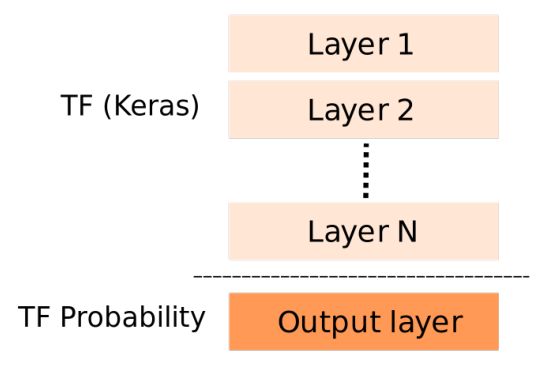
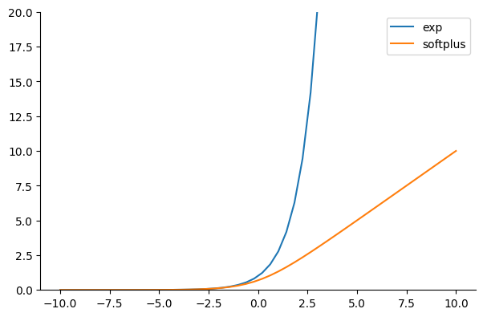
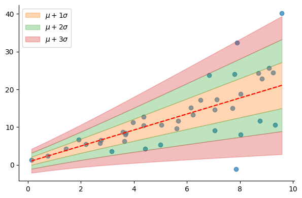
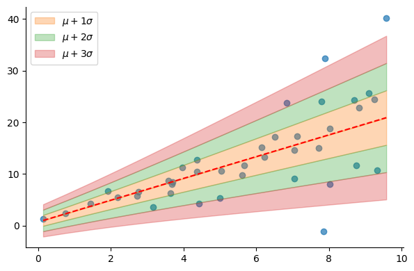
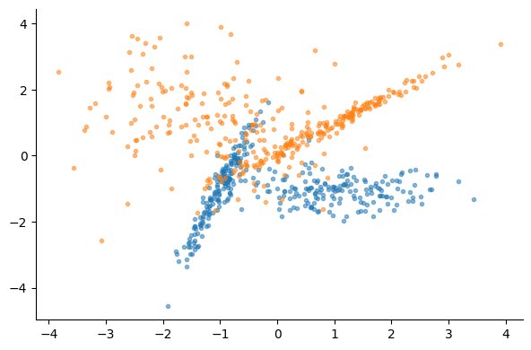
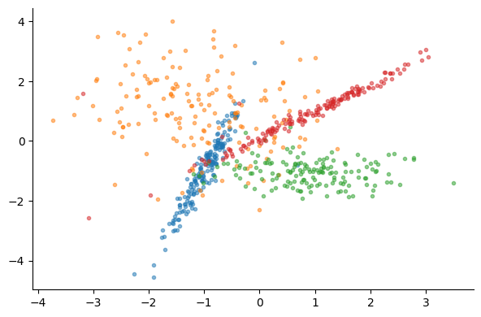

+++
title = 'Introduction to Tensorflow Probability and Pytorch Distributions'
author = 'Amine Sehili'
publishDate = '2024-02-14T23:04:48'
draft = false
+++

In previous articles, we explicitly defined code to compute the (log-)likelihood for a univariate Gaussian distribution. You might have noticed that we also cast our tensors to `float64` before training and made sure the loss functions deal with `float64` values. This step was necessary because, even for the very small dataset and models we used, using `float32` precision would quickly lead to numerical issues with our vanilla implementation of the loss functions. Writing code for more complex distributions would not only amplify these numerical issues but also turn out to be very tricky.

This is where [Tensorflow Probability](https://www.tensorflow.org/probability/) and [Pytorch Distributions](https://pytorch.org/docs/stable/distributions.html) come into play. These libraries allow us to deal with a big number of distributions and mixtures of distributions through a simple interface, providing the numerical stability required for complex models.

In the following, we'll first introduce the basic usage of Tensorflow Probability the move Pytorch Distributions. The latter generally follows Tensorflow Probability's design according to its [official documentation](https://pytorch.org/docs/stable/distributions.html).

## Creating probabilistic models with Tensorflow Probability

Roughly speaking, a probabilistic model created using Tensorflow Probability is structured as shown in the following figure.

  

    

The first N layers are standard Tensorflow layers and activations commonly found in various models. The last layer is where we use classes from Tensorflow Probability. This layer typically contains an instance of the desired distribution class(es) (e.g., `Normal`, `Gamma`, etc.) wrapped within a `DistributionLambda` object.

The final layer in the Tensorflow (Keras) block above should output the parameters needed for initializing the chosen distribution object. For instance, when using a normal distribution, this layer should have two outputs: the mean and the log of the standard deviation (std), unless we choose not to fit the std, as in the [first article](https://amsehili.github.io/posts/pdl/mle-for-regression-problems/). In that case this layer should output the mean of the normal distribution only.


```python
# tensorflow
import tensorflow as tf
from tensorflow import keras
from tensorflow.keras import backend as K
from tensorflow.keras import layers as tfkl
import tensorflow_probability as tfp
from tensorflow_probability import distributions as tfd

tfd = tfp.distributions

tf.random.set_seed(1234)
model = tf.keras.Sequential(
    [
        tfkl.Dense(2),
        tfp.layers.DistributionLambda(
            lambda theta: tfd.Normal(
                loc=theta[:, :1], scale=1e-3 + tf.math.softplus(0.05 * theta[:, 1:])
            )
        ),
    ]
)
```

Calling the model as in `model(X)` returns an instance of the `Distribution` class:


```python
np.random.seed(1234)
X = np.random.rand(2, 1)
y_hat = model(X)
assert isinstance(y_hat, tfd.Distribution)
model(X)
```


### Basic operations with Distribution objects
We can use instances of the Distribution class to perform various operations, including drawing random samples, computing statistics such as the mean and standard deviation, and calculating the probability (or density) of a specific input value.


```python
dist = model(X)
print("Random samples:\n", dist.sample().numpy())
print("Means:\n", dist.mean().numpy())
print("STDs:\n", dist.stddev().numpy())
```

    Random samples:
     [[-0.5108304 ]
     [-0.96020734]]
    Means:
     [[-0.25100866]
     [-0.8153463 ]]
    STDs:
     [[0.6879594 ]
     [0.67418814]]


As the input `X` in our example contains two instances (`X.shape` is `(2, 1)`), the generated samples, the means, and standard deviations correspond to two independent univariate Gaussian distributions, rather than a single multivariate Gaussian distribution with dimension two! This is reflected in the `batch_shape` of the `Distribution` object: each instance of `X` results into a separate univariate Gaussian distribution. The two Gaussians are encapsulated within a single `Distribution` object however.

Let's check this by creating normal distribution objects with scipy, initialized with the mean(s) and std(s) from our untrained model (with `X` as the input). Notice how `Distribution` objects understand broadcasting just like numpy arrays or Tensorflow/Pytorch tensors: we're computing the log probability of 1 with each of the two distributions independently (as if we were multiplying a scalar by numpy array).


```python
from scipy.stats import norm

mean = dist.mean().numpy().reshape(-1)
std = dist.stddev().numpy().reshape(-1)
dist_2 = norm(loc=mean, scale=std)

print("TFP:    ", dist.log_prob([1]).numpy().squeeze())
print("Scipy:  ", dist_2.logpdf([1]))
```

    TFP:     [-2.198264 -4.149849]
    Scipy:   [-2.198264   -4.14984897]


If we pass an array of 2 elements, however, then we're computing the log probability of each element with the corresponding distribution.


```python
print("TFP:  ", dist.log_prob([[1], [2]]).numpy().squeeze())
print("Scipy:", dist_2.logpdf([1, 2]))
```

    TFP:   [-2.198264 -9.243789]
    Scipy: [-2.198264   -9.24378801]


Finally, when we call the `log_prob` method of a `Distribution` object with an n-element array as input we get the probability (density) of each element with each of the distributions (we can't call the scipy distribution the same way). 


```python
print("TFP:\n", dist.log_prob([1, 2, 3, 4]).numpy().squeeze())
```

    TFP:
     [[ -2.198264  -5.897931 -11.710477 -19.635899]
     [ -4.149849  -9.243789 -16.537804 -26.031895]]


### Performing prediction with Distribution objects
Calling the `predict` method of the model doesn't have the outcome we expect but returns a random sample(s) drawn from the distribution(s):


```python
print("First call of predict:")
print(model.predict(X, verbose=False))

print("Second call of predict:")
print(model.predict(X, verbose=False))
```

    First call of predict:
    [[ 0.08102271]
     [-0.107131  ]]
    Second call of predict:
    [[-0.667113 ]
     [-1.2090466]]


We can check this by creating a model that contains a `Distribution` layer only with fixed parameters:


```python
model = tf.keras.Sequential(
    [tfp.layers.DistributionLambda(lambda theta: tfd.Normal(loc=2.5, scale=1.8))]
)
```

Then we call `model.predict` with an array of 10000 zeros and compute the mean and std (we could pass any values instead of 0). The obtained mean and std are close to the values fixed above:


```python
preds = model.predict(np.ones(10000), verbose=False)
preds.mean(), preds.std()
```


    (2.5886903, 1.8860008)


To obtain "useful" predictions from the model, we can leverage other statistics to get the model's best guess, as we'll see in the rest of the article.

### Fitting a linear regression model with a Distribution layer

Now we'll create and fit a linear regression model by using the `Normal` distribution class in the output layer. Note that unlike the first two articles, we're using **softplus** function instead of the exponential to guarantee that the std remains positive. The softplus function, defined as $\text{softplus}(x) = \log(\exp(x) + 1)$, increases linearly for large input values as illustrated in the following figure:


```python
X = np.linspace(-10, 10, 50)
plt.plot(X, np.exp(X), label="exp")
plt.plot(X, tf.math.softplus(X), label="softplus")
plt.legend()
plt.ylim(0, 20)
```

    

    

We then define the `NLL` loss function by calling the `log_prob` method of the predicted distribution instead of performing the computations manually:


```python
def NLL(y_true, y_pred):
    return -y_pred.log_prob(y_true)


model = tf.keras.Sequential(
    [
        tfkl.Dense(2),
        tfp.layers.DistributionLambda(
            lambda theta: tfd.Normal(
                loc=theta[:, :1], scale=1e-3 + tf.math.softplus(0.05 * theta[:, 1:])
            )
        ),
    ]
)

model.compile(optimizer=tf.keras.optimizers.Adam(learning_rate=0.01), loss=NLL)
```

We generate fake data with residual's variance that increases linearly as a function of the input $x$ and fit our model. The generated data is the same as the one generated in the [second article](https://amsehili.github.io/posts/pdl/fitting-probabilistic-nn-for-regression).


```python
import numpy as np
import matplotlib.pyplot as plt
from sklearn.linear_model import LinearRegression

# Generate synthetic data
N = 40
np.random.seed(1234)
X = np.random.rand(N, 1) * 10
X = X[np.argsort(X.squeeze())]

var = np.linspace(0.0, 10, N)
y = 2 * X.reshape(-1) + 1 + np.random.randn(N) * var

X = X.astype(np.float32)
y = y.astype(np.float32)
```

You might need to run the following code many times to reach the same loss.


```python
model.fit(X, y, epochs=1000, verbose=False)
model.fit(X, y, epochs=5, verbose=True)
```

    Epoch 1/5
    2/2 [==============================] - 0s 4ms/step - loss: 2.9864
    Epoch 2/5
    2/2 [==============================] - 0s 4ms/step - loss: 2.9863
    Epoch 3/5
    2/2 [==============================] - 0s 4ms/step - loss: 2.9864
    Epoch 4/5
    2/2 [==============================] - 0s 5ms/step - loss: 2.9866
    Epoch 5/5
    2/2 [==============================] - 0s 6ms/step - loss: 2.9864


For prediction, as we're using a normal distribution, we use the **mean** as the best guess of the model. Notice that, in the following figure, the std varies (almost) linearly as a function of the input thanks to using the softplus function.


```python
dist = model(X)
mu = dist.mean().numpy().reshape(-1)  # model's best guess
sigma = dist.stddev().numpy().reshape(-1)

plt.scatter(X, y, alpha=0.7)
plot_regression_line_with_std(X.reshape(-1), mu, sigma)
plt.legend()

```

    
 


## Pytorch Distributions
Pytorch Distributions are conveniently included as part of a standard Pytorch installation. The code examples below show how to create and train a model using Pytorch Distributions, like the one we created with Tensorflow Probability. Luckily, `Distribution` objects in both Pytorch and Tensorflow Probability share the same method name for computing log probabilities (`log_prob`), allowing us to use the previously defined `NLL` function without any modifications. Note, however, that in Pytorch Distributions, properties such as mean and stddev are accessed directly as fields rather than through method calls.


```python
# pytorch
import torch
from torch import nn
from torch import distributions as td
from torch.optim import Adam


class NormalModel(nn.Module):
    def __init__(self):
        super().__init__()
        self.lin = nn.Linear(1, 2)
        self.softplus = nn.Softplus()

    def forward(self, X):
        theta = self.lin(X)
        mu = theta[:, 0]
        sigma = 1e-3 + self.softplus(0.05 * theta[:, 1])
        # Build and return a normal distribution
        return td.Normal(mu, sigma)

    def predict(self, X):
        X = torch.tensor(X, dtype=torch.float32)
        with torch.no_grad():
            return self(X)


model = NormalModel()
```


```python
# pytorch
def train_model(X, y, model, optimizer, loss_fn, n_epochs=1, log_at=0):
    for epoch in range(1, n_epochs + 1):
        y_hat = model(X)  # y_hat is a Distribution object
        loss = loss_fn(y, y_hat).mean()
        optimizer.zero_grad()
        loss.backward()
        optimizer.step()
        if log_at <= 0:
            continue
        if epoch % log_at == 0:
            print(f"Epoch {epoch}, loss: {loss.item():.4f}")
```


```python
# pytorch
optimizer = Adam(model.parameters(), lr=0.01)
X_t = torch.tensor(X, dtype=torch.float32)
y_t = torch.tensor(y, dtype=torch.float32)

train_model(X_t, y_t, model, optimizer, NLL, n_epochs=1000, log_at=100)
```

    Epoch 100, loss: 4.5450
    Epoch 200, loss: 4.0642
    Epoch 300, loss: 3.7705
    Epoch 400, loss: 3.5750
    Epoch 500, loss: 3.4371
    Epoch 600, loss: 3.3356
    Epoch 700, loss: 3.2585
    Epoch 800, loss: 3.1984
    Epoch 900, loss: 3.1508
    Epoch 1000, loss: 3.1123


```python
dist = model.predict(X)
mu = dist.mean.numpy()
sigma = dist.stddev.numpy()

plt.scatter(X, y, alpha=0.7)
plot_regression_line_with_std(X.reshape(-1), mu, sigma)
plt.legend()
```



    

## Distribution layers for classification

In classification tasks, the **Kullback-Leibler Divergence** (KLD) is the standard loss function, measuring the (dis)similarity between the actual distribution of class labels and the model's predicted distribution. To illustrate this, consider a 5-class classification problem. The ground truth for an instance $x_i$ from the second class is typically represented by a one-hot vector: $y_i = [0, 1, 0, 0, 0]$. However, the model's prediction, $\hat{y}_i$, might be any 5-element vector of probabilities that sum to 1, for example $\hat{y}_i = [0.1, 0.3, 0.5, 0.02, 0.08]$.


The goal of the training process is to get a model's output, $\hat{y}_i$, as close as possible to the ground truth, $y_i$, for each input $x_i$ in the dataset. We use the KLD to measure how far is our model from that goal. The KLD between two distributions $p$ and $q$ is defined as:

$$
\text{KLD}(p\|\|q) = \sum_j p(y^{j}) \log \frac{p(y^{j})}{q(y^{j})}
$$

Importantly, note that the superscript $j$ (which we'll drop in the following equations) does *not* refer to the different instances of the dataset, but to the different elements of the $y_i$ and $\hat{y}_i$ probability arrays introduced above. More concretely, the KLD can be implemented as in the following code:


```python
EPSILON = 1e-5


def kld(p, q):
    assert len(p) == len(q)
    # we add EPSILON to the result of the division to avoid log 0
    return sum(p[j] * np.log(p[j] / q[j] + EPSILON) for j in range(len(p)))


p = y_i = [0, 1, 0, 0, 0]
q = y_hat_i = [0.1, 0.3, 0.5, 0.02, 0.08]
print(f"KLD: {kld(p, q):.4f}")
```

    KLD: 1.2040


The previous KLD equation can be written as:

$$
\begin{aligned}
\text{KLD}(p\|\|q) = & \sum_j p(y) \left(\log p(y) - \log q(y) \right) \\\\
                  = & \sum_j p(y) \log p(y) - \sum_j p(y) \log q(y)
\end{aligned}
$$

If we define $p(y)$ as $p_\mathcal{D}(y)$, that is the  ground truth distribution based on our dataset $\mathcal{D}$, and set $q(y) = p(y|\theta)$ as the distribution parameterized by $\theta$ and predicted by the model, then we have:

$$
\text{KLD}(p\|\|q) = \sum_j p_\mathcal{D}(y) \log p_D(y) - \sum_j p_\mathcal{D}(y) \log p(y|\theta)
$$

Notice the first summation involves only $p_\mathcal{D}(y)$, which is a constant quantity that can be computed from our dataset. It doesn't influence the optimization process and can be removed. The equation becomes:

$$
\text{KLD}(p\|\|q) = \text{const} -  \sum_j p_\mathcal{D}(y) \log p(y|\theta)
$$

As outlined above, the ground truth vector of probabilities, denoted as $p_\mathcal{D}(y)$, is normally a one-hot encoded vector with all elements set to 0 except for a single position that we denote by $j^{\star}$, set to 1. As a result, $\sum_j p_\mathcal{D}(y) \log p(y | \theta)$ from the equation simplifies to $\log p(y^{j^{\star}} | \theta)$.

For clarity, we omit $j^{\star}$ in our notation in the following equations. Considering all $N$ instances in our dataset, the previous equation can be written as:

$$
\begin{aligned}
\text{KLD}(p\|\|q) & = \text{const} - \frac{1}{N} \sum_{i=1}^{N} \log p(y_i | \theta) \\\\
                 & = \text{const} + \text{NLL}(\theta)
\end{aligned}
$$

That $- \sum_{j} p_\mathcal{D}(y) \log p(y | \theta)$ quantity above, which finally reduces to  $\text{NLL}(\theta)$, is referred to as **cross-entropy** and is what we want the training process to minimize. In Keras you'd pass `binary_crossentropy` (for binary classification) or `categorical_crossentropy` (for multiclass classification) as the loss function to compile a classification model. In Pytorch you'd specify `nn.BCELoss` or `nn.CrossEntropyLoss` as the loss function.

Hence, minimizing the KLD in the context of classification boils down to minimizing the NLL or performing the Maximum Likelihood Estimation (MLE) introduced in the [first article](https://amsehili.github.io/posts/pdl/mle-for-regression-problems/index.html).


To check everything, let's define and run a `cross_entropy` function:


```python
def corss_entropy(p, q):
    return -sum(p[j] * np.log(q[j] + EPSILON) for j in range(len(p)))

corss_entropy(p, q)

print(f"Corss-entropy: {corss_entropy(p, q):.4f}")
```

    Corss-entropy: 1.2039


The output is similar to that of the `kld` function defined above. This is the case because the $\text{const}$ term that appears in the KLD equation is equal to 0. Actually, $\text{const} = \sum p_\mathcal{D}(y) \log p_D(y)$ is the equal to $-\mathbb{H}(p_\mathcal{D})$ where $\mathbb{H}$ is the [entropy](https://en.wikipedia.org/wiki/Entropy_(information_theory)) of the data. Given that our ground truth distribution has one single outcome with probability 1 and all the other outcomes with probability 0 (for each $(x_i, y_i)$ pair in the data), the entropy is 0.

### A binary classification model
We'll first generate some fake binary classification data and fit a logistic regression model using sci-kit learn:


```python
from sklearn.datasets import make_classification
from sklearn.linear_model import LogisticRegression
from sklearn.metrics import accuracy_score, f1_score


X, y = make_classification(
    random_state=42,
    n_samples=1000,
    n_features=2,
    n_redundant=0,
    n_repeated=0,
    flip_y=0.01,
    class_sep=1,
)
X_train, y_train = X[:700], y[:700]
X_test, y_test = X[700:], y[700:]

X.shape, y.shape, list(y[:5])

mask = y_train == 0
plt.scatter(X_train[mask, 0], X_train[mask, 1], marker=".", alpha=0.5)
plt.scatter(X_train[~mask, 0], X_train[~mask, 1], marker=".", alpha=0.5)
```
    



```python
logreg_model = LogisticRegression()
logreg_model.fit(X_train, y_train)

y_pred = logreg_model.predict(X_test)
accuracy_score(y_test, y_pred)
```

    0.8666666666666667


Given that we're dealing with a binary classification problem, the **Bernoulli** distribution is what we need to specify in the final layer of the model. The `Bernoulli` class in both Tensorflow Probability and Pytorch Distributions takes either the probability of the positive event, $p(y = 1)$, or the $\text{logit}$ as input. If we choose to pass the probability, we should specify the sigmoid function as the activation of the layer the precedes the distribution layer. In the following, we will pass the $\text{logit}$ to the distribution layer and let it turn it into a probability.


{}
```python
# pytorch
class LogisticRegressionModel(nn.Module):
    def __init__(self):
        super().__init__()
        self.lin = nn.Linear(2, 1)

    def forward(self, X):
        logits = torch.selu(self.lin(X))
        return td.Bernoulli(logits=logits)

    def predict(self, X):
        X = torch.tensor(X, dtype=torch.float32)
        with torch.no_grad():
            return self(X)

model = LogisticRegressionModel()
```
{}

{}
```python
# tensorflow
model = tf.keras.Sequential([
  tfkl.Dense(1), tfp.layers.DistributionLambda(lambda theta: tfd.Bernoulli(logits=theta))])

model.compile(optimizer=tf.keras.optimizers.Adam(learning_rate=0.01), loss=NLL)
```
{}




{}

```python
# pytorch
optimizer = Adam(model.parameters(), lr=0.01)
X_t = torch.tensor(X_train, dtype=torch.float32)
y_t = torch.tensor(y_train, dtype=torch.float32)[:, None]

train_model(X_t, y_t, model, optimizer, NLL, n_epochs=500, log_at=100)
```

{}

{}
```python
# tensorflow
model.fit(X_train, y_train, epochs=500, verbose=False);
model.fit(X_train, y_train, epochs=1, verbose=True);
```
{}


    Epoch 100, loss: 0.4137
    Epoch 200, loss: 0.3661
    Epoch 300, loss: 0.3497
    Epoch 400, loss: 0.3425
    Epoch 500, loss: 0.3389



{}
```python
y_hat = model.predict(X_test).mean.numpy().reshape(-1)  > 0.5
accuracy_score(y_test, y_hat)
```
{}

{}

```python
# tensorflow
y_hat = model(X_test).mean().numpy().reshape(-1)  > 0.5
accuracy_score(y_test, y_hat)
```
{}


    0.8666666666666667


## Multiclass classification
For multiclass classification, we can use the `Multinomial` or the more convenient `Categorical` distribution class as the last layer of our model instead of `Bernoulli`. 

For a 4-class classification problem for example, if the ground truth is the third class, the model's output (more accurately, the output of the last layer preceding the probabilistic layer) that makes the NLL close to 0 should be something close to `[0, 0, 1, 0]`:


{}
```python
# pytorch
cat = td.Categorical(probs=torch.tensor([0.001, 0.001, 0.996, 0.002]))
nll = -cat.log_prob(torch.tensor([2]))
prob = torch.exp(cat.log_prob(torch.tensor([2])))
print(f"NLL: {nll.item():.4f}, prob: {prob.item():.4f}")
```
{}

{}
```python
# tensorflow
cat = tfd.Categorical(probs=[0.001, 0.001, 0.996, 0.002])
nll = -cat.log_prob([2]).numpy()[0]
prob = tf.exp(cat.log_prob([2])).numpy()[0]
print(f"NLL: {nll:.4f}, prob: {prob:.4f}")
```
{}


    NLL: 0.0040, prob: 0.9960


### A multiclass classification model
The model architecture is quite similar to the one we used for logistic regression. The most notable difference is the use of more parameters in the first layer, which followed by a non-linear activation, and the use of the `Categorical` class in the output layer instead of `Bernoulli`. And of course, we'll be using the same `NLL` loss function defined earlier to train the model.


```python
from sklearn.model_selection import train_test_split

n_classes = 4
X, y = make_classification(random_state=42,
                           n_samples=1000,
                           n_features=2,
                           n_redundant=0,
                           n_repeated=0, 
                           flip_y=0.01,
                           class_sep=1,
                           n_classes=n_classes,
                           n_clusters_per_class=1,
                           )

X_train, X_test, y_train, y_test = train_test_split(X, y, test_size=1/3)

for label in range(n_classes):
    mask = y_train == label
    plt.scatter(X_train[mask, 0], X_train[mask, 1], marker=".", alpha=0.5)

```
    




{}
```python
# pytorch
class MulticlassClassifier(nn.Module):
    def __init__(self, n_features, n_classes):
        super().__init__()

        self.lin = nn.Linear(n_features, 128)
        self.activation = torch.relu
        self.output = nn.Linear(128, n_classes)

    def forward(self, X):
        logits = self.output(self.activation(self.lin(X)))
        return td.Categorical(logits=logits)

    def predict(self, X):
        X = torch.tensor(X, dtype=torch.float32)
        with torch.no_grad():
            return self(X)


model = MulticlassClassifier(n_features=2, n_classes=n_classes)
```
{}

{}
```python
# tensorflow
model = tf.keras.Sequential(
    [
        tfkl.Dense(128, activation="relu"),
        tfkl.Dense(n_classes),
        tfp.layers.DistributionLambda(lambda theta: tfd.Categorical(logits=theta)),
    ]
)

model.compile(optimizer=tf.keras.optimizers.Adam(learning_rate=0.01), loss=NLL)
```
{}




{}
```python
# pytorch
optimizer = Adam(model.parameters(), lr=0.01)
X_t = torch.tensor(X_train, dtype=torch.float32)
y_t = torch.tensor(y_train, dtype=torch.float32)

train_model(X_t, y_t, model, optimizer, NLL, n_epochs=100, log_at=20)
```

{}

{}
```python
# tensorflow
model.fit(X_train, y_train, epochs=100, verbose=False)
model.fit(X_train, y_train, epochs=5, verbose=True)
```
{}


    Epoch 20, loss: 0.5224
    Epoch 40, loss: 0.4499
    Epoch 60, loss: 0.3977
    Epoch 80, loss: 0.3609
    Epoch 100, loss: 0.3386


For prediction, we'll use the **mode** of the distribution as the best guess. This makes sense because the most frequent value is the value with the highest probability for the Categorical distribution:


{}
```python
# pytorch
from collections import Counter

# The second class (label = 1) has the highest probability
cat = td.Categorical(probs=torch.tensor([0.05, 0.5, 0.3, 0.015]))
counts = Counter(cat.sample((1000, 1)).numpy().squeeze())
print(f"Class frequencies: {counts.most_common()}")
print(f"Distribution mode: {cat.mode.item()}")
```
{}

{}
```python
# tensorflow
from collections import Counter

# The second class (label = 1) has the highest probability
cat = tfd.Categorical(probs=[0.05, 0.5, 0.3, 0.015])
counts = Counter(cat.sample(1000).numpy())
print(f"Class frequencies: {counts.most_common()}")
print(f"Distribution mode: {cat.mode()}")
```
{}



    Class frequencies: [(1, 553), (2, 356), (0, 72), (3, 19)]
    Distribution mode: 1



{}
```python
# pytorch
y_hat = model.predict(X_test).mode
accuracy_score(y_test, y_hat)
```
{}

{}
```python
# tensorflow
y_hat = model(X_test).mode()
accuracy_score(y_test, y_hat)
```
{}


    0.8562874251497006


# Summary
In this third article, we introduced the basic concepts of using Tensorflow Probability and Pytorch Distributions to build probabilistic neural networks. We demonstrated how the Maximum Likelihood Estimation (MLE) is applied to fit classification models via the NLL loss. We also built a binary and a multiclass classification models using two different `Distribution` classes and showed how to get the model's best guess depending on the kind of the distribution.
