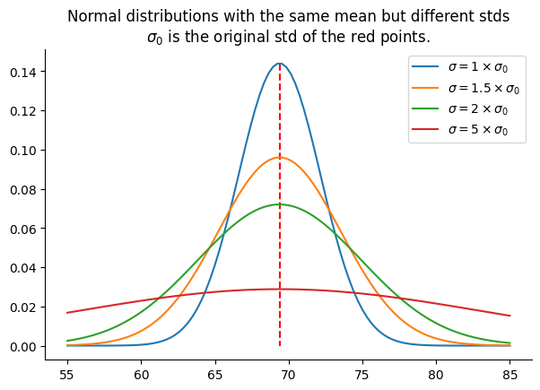
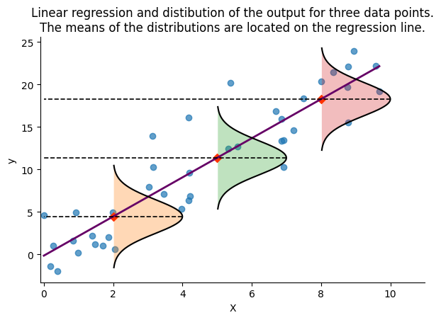

+++
title = 'Maximum Likelihood Estimation for regression problems'
author = 'Amine Sehili'
publishDate = '2024-01-27T22:36:18'
draft = false
+++

# Introduction
In a binary or a multiclass classification problem, the output of a machine learning model is usually the conditional probability that the target, $y$, equals each class $c_i$ (out of $C$ classes in the data) given some input $x$ and the model parameters $w$:

In a binary or multiclass classification problem, the output of a machine learning model is typically represented as the conditional probability that the target variable, $y$, corresponds to each specific class $c_i$​ (from a total of $C$ classes in the dataset), given an input $x$ and the model parameters $w$.

$$ p_i(y = c_i | x, w) \quad $$

for $i \in \{0, \ldots, C-1\}$ and $\sum{p_i} = 1$.

These $p_i$ probabilities represent the **parameters of a distribution** over the classes, given the input $x$ and the model parameters $w$. In other words, for each input $x$, the model's output can be used to build a probability distribution function, which then allows us to compute the probability that $x$ belongs to each class.

In the case of binary classification with two classes $c_0=0$ and $c_1=1$, the model outputs $p_1$ as the probability that the input $x$ belongs to class $c_1$, with $p_0 = 1 - p_1$ indicating the probability of $x$ belonging to class $c_0$. In this scenario, $p_1$ is equivalent to the parameter $p$ of a Bernoulli distribution:

$$
P(y) =
    \begin{cases}
      p_0 & \text{for} \quad y=0 \\\\
      p_1 & \text{for} \quad y=1
    \end{cases}
$$


Multiclass classification models output the class probabilities, which can be seen as the event probabilities $p_{1} \dots p_{C-1}$ of a multinomial distribution:

$$
  P(y) =
    \begin{cases}
      p_0 & \text{for} \quad y=0 \\\\
      p_1 & \text{for} \quad y=1 \\\\
      ~ \vdots    & \quad \vdots  \\\\
      p_{C-1} & \text{for} \quad y=C-1
    \end{cases}
$$

  

    


Classification models, which provide probabilities for each class (such as neural networks) rather than a definitive output, allow us to quantify the uncertainty of the prediction. Such models are already probabilistic. This is a nice feature because it allows us to decide how to interpret and use the model's output, especially in cases where no single class has a significantly higher probability than others.

For binary classification for example, we'd have more doubts about an output probability of 0.52 than for a probability of 0.95, and the actions that we choose for each case might be different.

In contrast, regression models provide a *single* output based on a given input. This output is considered as the *best guess* of the model given the input. They don't provide additional information to evaluate the uncertainty of their predictions.

## Probabilistic neural networks

Probabilistic neural networks are a kind of models that output a distribution instead of a single output, either for classification or for regression tasks. To build such models, we proceed through the following steps:

- Pick a distribution family that the target ($y$) is assumed to originate from (e.g., Gaussian for normally distributed data, Poisson for count data, Exponential distribution for waiting time, etc.)
- Create a model that outputs the **parameters** $\theta$ of the chosen distribution for each input $x$ instead of predicting the target value directly $y$.
- Define a loss function that allows the model's parameters to be tuned in a way that maximizes the likelihood of the target $y$ given an input $x$ and the distribution's parameters $\theta$.


In the following, we'll go through a linear regression example, assuming that the data is Gaussian. We'll derive the **Negative Log-Likelihood** Loss (NLL) and show that is equivalent to **Mean Squared Error** (MSE) under the assumptions of linear regression. Next, we'll define a small regression model (in Pytorch and Tensorflow) and fit it using NLL as the loss function.

In subsequent articles of this series, we'll systematically use NLL to fit all sorts of probabilistic neural networks regardless of the distribution of the data.

**Note:** we use $w$ to refer to the parameters (i.e., weights) of a neural network, and $\theta$ for the parameters of the distribution. In fact, $\theta$ is the *output* of the model.

## A first motivating example
Consider the following dataset of parents' and children's heights by [Francis Galton](https://en.wikipedia.org/wiki/Francis_Galton):

```python
import pandas as pd

data = pd.read_csv("data/galton-heights.csv", delimiter="\t")
data
```

<div>
<table border="1" class="dataframe">
  <thead>
    <tr style="text-align: center;">
      <th>family</th>
      <th>father</th>
      <th>mother</th>
      <th>gender</th>
      <th>height</th>
      <th>kids</th>
      <th>male</th>
      <th>female</th>
    </tr>
  </thead>
  <tbody>
    <tr>
      <td>1</td>
      <td>78.5</td>
      <td>67.0</td>
      <td>M</td>
      <td>73.2</td>
      <td>4</td>
      <td>1.0</td>
      <td>0.0</td>
    </tr>
    <tr>
      <td>1</td>
      <td>78.5</td>
      <td>67.0</td>
      <td>F</td>
      <td>69.2</td>
      <td>4</td>
      <td>0.0</td>
      <td>1.0</td>
    </tr>
    <tr>
      <td>1</td>
      <td>78.5</td>
      <td>67.0</td>
      <td>F</td>
      <td>69.0</td>
      <td>4</td>
      <td>0.0</td>
      <td>1.0</td>
    </tr>
    <tr>
      <td>1</td>
      <td>78.5</td>
      <td>67.0</td>
      <td>F</td>
      <td>69.0</td>
      <td>4</td>
      <td>0.0</td>
      <td>1.0</td>
    </tr>
    <tr>
      <td>2</td>
      <td>75.5</td>
      <td>66.5</td>
      <td>M</td>
      <td>73.5</td>
      <td>4</td>
      <td>1.0</td>
      <td>0.0</td>
    </tr>
    <tr>
      <td>...</td>
      <td>...</td>
      <td>...</td>
      <td>...</td>
      <td>...</td>
      <td>...</td>
      <td>...</td>
      <td>...</td>
    </tr>
    <tr>
      <td>136A</td>
      <td>68.5</td>
      <td>65.0</td>
      <td>M</td>
      <td>68.5</td>
      <td>8</td>
      <td>1.0</td>
      <td>0.0</td>
    </tr>
    <tr>
      <td>136A</td>
      <td>68.5</td>
      <td>65.0</td>
      <td>M</td>
      <td>67.7</td>
      <td>8</td>
      <td>1.0</td>
      <td>0.0</td>
    </tr>
    <tr>
      <td>136A</td>
      <td>68.5</td>
      <td>65.0</td>
      <td>F</td>
      <td>64.0</td>
      <td>8</td>
      <td>0.0</td>
      <td>1.0</td>
    </tr>
    <tr>
      <td>136A</td>
      <td>68.5</td>
      <td>65.0</td>
      <td>F</td>
      <td>63.5</td>
      <td>8</td>
      <td>0.0</td>
      <td>1.0</td>
    </tr>
    <tr>
      <td>136A</td>
      <td>68.5</td>
      <td>65.0</td>
      <td>F</td>
      <td>63.0</td>
      <td>8</td>
      <td>0.0</td>
      <td>1.0</td>
    </tr>
  </tbody>
</table>
<p>898 rows × 8 columns</p>
</div>


Let's fit and visualize a linear regression model that predicts sons' heights based on fathers' heights:

{}
```python
import numpy as np
from matplotlib import pyplot as plt
from sklearn.linear_model import LinearRegression

X = data["father"][data["gender"] == "M"].to_numpy()[:, None]
y = data["height"][data["gender"] == "M"].to_numpy()
argsort = np.argsort(X.reshape(-1))
X = X[argsort]
y = y[argsort]
fathers_70in_mask = X.reshape(-1) == 70

model = LinearRegression().fit(X, y)
y_hat = model.predict(X)

plt.scatter(X[:, 0][~fathers_70in_mask], y[~fathers_70in_mask], alpha=0.7)
plt.scatter(X[:, 0][fathers_70in_mask], y[fathers_70in_mask], c="red", alpha=0.3)
plt.plot(X[:, 0], y_hat, c="#800080", lw=2, label="Regression line")
```
{}
 

    


This model outputs a single value as an estimate of a son's height based on a given father's height. however, looking at the data, we can figure out that a specific father's height can be associated with a broad range of son's heights. Typically, when given a father's height, the model produces a value that's approximatively the average height of sons whose fathers share a similar height to the input value.

For a father's height equal to 70 inches for example, the model predicts **69.54** as the son's height. The average of the sons' height for all 70-inche tall fathers in the dataset (red points in the plot) is **69.03**. If we were given only data for 70-inche fathers, then the best prediction we can make is that average value of **69.03**. The model's prediction, **69.54** is slightly different because the model should be a straight line that also *works* for other points in the dataset.

That said, instead of accepting **69.03** as the final output, we can look at the distribution of the red points for further analysis. Assuming a normal distribution for the data, we can compute the mean (**69.03**) and the standard deviation, std (**2.77**) of the data, build a distribution, and plot the probability density like in the following figure:


```python
from scipy.stats import norm

mean = y[fathers_70in_mask].mean()
std = y[fathers_70in_mask].std()
dist = norm(mean, std)
heigths = np.linspace(55, 85, 100)
likelihood = dist.pdf(heigths)

plt.plot(heigths, likelihood)
plt.plot([mean, mean], [dist.pdf(mean), 0], "--", c="red")
plt.title("Distribution of the red points")
```
 

    

One thing to consider when examining a normal distribution is the flatness of the bell-shaped probability density curve. While it's true that the mean (69.03) represents the value with the highest probability density, it's essential to note that other values are also possible. Actually, the flatter the curve, the lower the probability of observing the mean. This flatness is determined by the standard deviation of the distribution: the higher the standard deviation, the flatter the curve. The following figure illustrates the probability density of several normal distributions with std equal to 1x, 1.5x, 2x, and 5x the original std of the red points:

{}
```python
for factor in [1, 1.5, 2, 5]:
    dist = norm(mean, std * factor)
    if factor == 1:
        plt.plot([mean, mean], [dist.pdf(mean), 0], "--", c="red")
    likelihood = dist.pdf(heigths)
    plt.plot(
        heigths,
        likelihood,
        label=f"$\sigma={factor} \\times \sigma$",
    )
plt.title("Normal distributions with the same mean but different stds")
plt.legend()
```
{}



    


Next, we replace the original sons' heights, associated with fathers who are 70 inches tall (as indicated by the red points in the figure above), with values randomly sampled from a normal distribution. This distribution has the same mean as the red points' but with a standard deviation that is twice the original standard deviation, corresponding to the green curve in the previous figure.

The following figure shows the regression line of both the original data and the modified data:


```python
from sklearn.linear_model import LinearRegression
import numpy as np

np.random.seed(1)
n_fathers_70in = fathers_70in_mask.sum()

y_update = y.copy()
y_update[fathers_70in_mask] = np.random.normal(
    y[fathers_70in_mask].mean(),
    y[fathers_70in_mask].std() * 2,
    n_fathers_70in,
)
model_2 = LinearRegression().fit(X, y_update)
y_update_hat = model_2.predict(X)

plt.scatter(
    X[:, 0][~fathers_70in_mask],
    y_update[~fathers_70in_mask],
    alpha=0.7,
)
plt.scatter(
    X[:, 0][fathers_70in_mask],
    y_update[fathers_70in_mask],
    c="red",
    alpha=0.3,
)
plt.plot(
    X[:, 0],
    y_hat,
    c="#800080",
    lw=2,
    label="Regression line of original data",
)
plt.plot(
    X[:, 0],
    y_update_hat,
    ls="--",
    c="#ffb31a",
    label="Regression line for data with increased std red points' std",
)
plt.legend()
```

    

    

```python
print(model.predict([[70]]), model_2.predict([[70]]))
```

    [69.60126644] [69.62315936]


As we can see, the model has hardly changed and generates almost identical outputs to the original model when $x$ = 70. However, because we manually modified the data, we know that the prediction made by the second model is somewhat less certain for $x$ = 70. A non-probabilistic model outputs predictions that we can only accept as-is, without a mean to assess the uncertainty of these predictions.

We can further increase the spread of the red points by an arbitrary amount with negligible impact on the obtained models. all the models are as confident as the model fitted on the original data when predicting the height of a son whose father is 70 inches tall. This is illustrated in the following figure, where $\sigma_0$ is the original standard deviation of the red points:

{}

```python
fig = plt.figure(figsize=(18, 4))
np.random.seed(1)
for i, factor in enumerate([2, 3, 5], 1):
    plt.subplot(1, 3, i)
    y_update = y.copy()
    y_update[fathers_70in_mask] = np.random.normal(
        y[fathers_70in_mask].mean(),
        y[fathers_70in_mask].std() * factor,
        n_fathers_70in,
    )

    model_2 = LinearRegression().fit(X, y_update)
    y_update_hat = model_2.predict(X)

    plt.scatter(
        X[:, 0][~fathers_70in_mask],
        y_update[~fathers_70in_mask],
        alpha=0.7,
    )
    plt.scatter(
        X[:, 0][fathers_70in_mask],
        y_update[fathers_70in_mask],
        c="red",
        alpha=0.3,
    )
    plt.plot(X[:, 0], y_hat, c="#800080")
    plt.plot(X[:, 0], y_update_hat, ls="--", c="#ffb31a")
    plt.title(f"std = {factor} $\\times \\sigma$")
```
{}

    

    


# Fitting regression models

## MSE

MSE is very frequently used for regression problems. It's defined as the average of the squared differences between the predicted values and the actual values:

$$
\text{MSE(}\mathcal{D}\text{)} = \frac{1}{N}\sum_{i=1}^{N}(y_i - \hat{y}_i)^2
$$

Where $\mathcal{D}$ is a dataset and $N$ is the number of data samples. For linear regression, we have $\hat{y}_i = f_w(x_i) = a \cdot x_i + b$, and we have:

$$\text{MSE(}\mathcal{D}\text{)} = \frac{1}{N}\sum_{i=1}^{N}(y_i - (a \cdot x_i + b))^2$$

The following code block generates synthetic data, fits a linear model using MSE, and plots the differences between the predicted values (i.e., the regression line) and the original data points:

{}
```python
import numpy as np
import matplotlib.pyplot as plt
from sklearn.linear_model import LinearRegression

# Generate synthetic data
N = 40
np.random.seed(1)
X = np.random.rand(N, 1) * 10
X = X[np.argsort(X.squeeze())]
y = 2 * X.reshape(-1) + 1 + np.random.randn(N) * 4

# Fit a linear regression model
lin_model = LinearRegression()
lin_model.fit(X, y)

# Predictions using the model
y_hat = lin_model.predict(X)

# Draw data points and regression line
plt.scatter(X, y, alpha=0.7)
plt.plot(X, y_hat, c="#800080", lw=2)

# Draw lines between data points and the regression line
for i in range(len(X)):
    plt.plot(
        [X[i], X[i]],
        [y[i], y_hat[i]],
        c="red",
        ls="--",
        lw=1,
    )

plt.xlabel("X")
plt.ylabel("y")
plt.title("Linear regression with data points and residuals")
```
{}
    

    


## Maximum Likelihood Estimation
Another common approach to modeling the data is to pick a probability density function $p$ with parameters $\theta$ and find the values of $\theta$ that maximize the likelihood of the observed data:

$$
\hat{\theta}_{\text{MLE}} = \underset{\theta}{\operatorname{argmax}}~p(\mathcal{D}|\theta)
$$

Assuming that the data samples are independent and identically distributed (i.i.d.), the probability of the entire dataset, denoted as $p(\mathcal{D}|\theta)$, can be expressed as:

$$
p(\mathcal{D}|\theta) = \prod_{i=1}^{N}p(y_i|x_i, \theta_i)
$$

which is the product of probabilities $p(y_i)$ given the inputs $x_i$ and $\theta_i$, the parameters of the probability density.

Notice that we explicitly use the subscript $i$ on the right side of the previous equation for $x$, $y$ and the model parameters $\theta$. This is to emphasize the fact that we're dealing with a supervised problem. In fact, our goal is to create a conditional model $p(y_i|x_i)$ parametrized by $\theta_i$ for each $(x_i, y_i)$ pair in the dataset. This is different from the unsupervised learning, where we're only given $y$ (often using $x$ instead of $y$ to refer to the data) and our goal is to fit the unconditional distribution $p(y)$.

More precisely, our goal is to come up with a function $f_w(x_i) = \theta_i$ that maximizes the conditional probability mentioned above. It's important to highlight that $f_w$ is the same for all $(x_i, \theta_i)$. It can be a neural network, for example, that takes $x_i$ as input and returns as many values as we need for the distribution we picked for our data.

## NLL
Instead of multiplying the probabilities as in the previous equation, we can compute the sum of their logarithms to obtain the **Log-Likelihood**:

$$
\log p(\mathcal{D}|\theta) = \sum_{i=1}^{N} \log p(y_i|x_i, \theta_i)
$$

To fit a neural network, we typically need a loss function to minimize, rather than a quantity to maximize. We can turn the previous function into a loss function by taking its negative, resulting in what is known as the **Negative Log-Likelihood**:

$$
\text{NLL}(\mathcal{D}|\theta) = - \log p(\mathcal{D}|\theta) = - \sum_{i=1}^{N} \log p(y_i|x_i, \theta_i)
$$


## Going from NLL to MSE under the assumptions of linear regression

So far, we have assumed that our data samples are independent and identically distributed (i.i.d.). For a linear regression problem, we also assume that the residuals (i.e., prediction errors) follow a normal distribution. Therefore, we can represent the probability density function $p$ as a Gaussian distribution with parameters $\theta = (\mu, \sigma)$, where $\mu$ represents the center of the distribution (i.e., the mean), and $\sigma$ represents its scale (i.e., standard deviation). The probability density function (PDF) of a Gaussian distribution is defined as:

$$
p(y|\mu, \sigma) = \frac{1}{\sigma \sqrt{2\pi}} e^{-\frac{(y - \mu)^2}{2\sigma^2}}
$$

Substituting the formula of the normal distribution into the definition of NLL above, we obtain:

$$
\begin{aligned}
p(\mathcal{D}|\theta) = & \prod_{i=1}^{N}p(y_i|\mu_{x_i}, \sigma_{x_i}) \\\\
~  = & \prod_{i=1}^{N} \left(\frac{1}{\sigma_{x_i} \sqrt{2\pi}} e^{-\frac{(y_i - \mu_{x_i})^2}{2\sigma_{x_i}^2}}\right)
\end{aligned}
$$

For the sake of clarity, we use $x_{i}$ as a subscript for $\mu_{x_i}$ and $\sigma_{x_i}$ to emphasize that when computing the probability density of $y_i$, the parameters of the normal distribution are determined as a function of $x_i$: $\theta_i = f_w(x_i) = (\mu_{x_i}$, $\sigma_{x_i})$.

By taking the negative of the logarithm, we obtain the NLL:

$$
\begin{aligned}
-\log p(\mathcal{D}|\theta) = & - \sum_{i=1}^{N} \log \left(\frac{1}{\sigma_{x_i} \sqrt{2\pi}} e^{-\frac{(y_i - \mu_{x_i})^2}{2\sigma_{x_i}^2}}\right) \\\\
                       = & - \sum_{i=1}^{N} \log \left(\frac{1}{\sigma_{x_i} \sqrt{2\pi}}\right) - {\frac{(y_i - \mu_{x_i})^2}{2\sigma_{x_i}^2}}
\end{aligned}
$$


The final step to simplifying the previous equation involves considering the assumption of **homoscedasticity** for linear regression. Homoscedasticity asserts that the variance of the residuals is constant across all values of the independent variable. In simpler terms, this assumption implies that the spread of residuals should be roughly constant along the entire range of predicted values, indicating that the std of the target/dependent variable $y$ remains constant and isn't influenced by changes in $x$.

Thus, we can omit the constant terms involving the std from the previous equation, as they don't influence the result of the optimization:

$$
-p(\mathcal{D}|\theta) = - \sum_{i=1}^{N} \bcancel{\log} \bcancel{\left(\frac{1}{\sigma_{x_i} \sqrt{2\pi}}\right)} - {\frac{(y_i - \mu_{x_i})^2}{ \bcancel{2\sigma_{x_i}^2}}}
$$

Dividing by $N$ we finally obtain:

$$ \text{NLL}(\mathcal{D}|\theta) = \frac{1}{N}\sum_{i=1}^{N} (y_i - \mu_{x_i})^2$$

This looks much like the MSE defined above. Indeed, under the assumptions of linear regression, these two loss functions become equivalent, with $\mu_{x_i} = a \cdot x_i + b$, where $a$ and $b$ are the parameters (slop and bias) of the linear model.

You might wonder why use NLL since it's the same as MSE. The reason will become clear in upcoming articles, where we'll relax some linear regression assumptions and extend our model to include the other parameter of a Gaussian distribution, $\sigma$. This will allow us to compute the likelihood of the predicted values and assess the uncertainty of the model's predictions. Moreover, we'll explore fitting the parameters of other distributions or mixtures of distributions in scenarios where MSE may not be a suitable choice. This approach provides a more flexible framework for modeling complex datasets.


## Output of a probabilistic model
As mentioned earlier, a probabilistic model outputs the parameters of a distribution, such as the mean and standard deviation, rather than a single fixed value. This approach means that for any given input, we obtain not only the model's predicted value (typically the mean of the distribution) but also can calculate the probability density for this prediction and other possible outcomes.

The following figure demonstrates this concept by depicting the regression line alongside the Gaussian distributions that represent the probabilistic model's outputs for three selected input values. The mean of each distribution is aligned with the regression line, indicating our predictions. Currently, we use a constant standard deviation of 2, a simplification that we will address in the next article by discussing how to model this parameter dynamically, thereby improving our understanding of the model's uncertainty.

{}
```python
fig, ax = plt.subplots()

plt.scatter(X, y, label="Data Points", alpha=0.7)
plt.plot(X, y_hat, c="#660066", lw=2)

support = np.linspace(-6, 6, 1000)
selected_X = np.array([2, 5, 8])
selected_y = lin_model.predict(selected_X[..., None])
for xpos, ypos in zip(selected_X, selected_y):
    draw_gaussian_at(
        support,
        std=2,
        height=2,
        xpos=xpos,
        ypos=ypos,
        ax=ax,
        c="k",
    )

plt.scatter(selected_X, selected_y, c="#ff3300", marker="D")
plt.xlim(-0.1, 11)
plt.xlabel("X")
plt.ylabel("y")
plt.title(
    "Linear regression and distibution of the output"
    " for three data points.\nThe means of the"
    " distributions are located on the regression line."
)
```
{}
   

    


# Fitting regression models with NLL
In this section, we define and fit our first model using NLL as the loss function. The model is a simple neural network with a single linear layer that outputs the mean of a Gaussian distribution. Assuming the data follows a normal distribution, we utilize the Gaussian density function to define our NLL. However, in this version of the model, we keep the standard deviation (std) constant and do not include it as an output of the model.

As a result, despite utilizing NLL as the loss function, the model we obtain will be similar to a model fitted with MSE. This similarity arises because, under the assumptions of linear regression, NLL and MSE are effectively equivalent when the error distribution is Gaussian with a standard deviation that does not depend on the input. In subsequent articles, we'll extend the model to fit the standard deviation as well.

In this article and the next, we will explicitly write Python code to implement the Gaussian probability function and the NLL. This will help us understand how NLL is used as a loss in the context of probabilistic modeling and regression analysis. Later, we will transition to more efficient and numerically stable implementations of NLL provided by [PyTorch](https://pytorch.org/docs/stable/distributions.html) and [TensorFlow Probability](https://www.tensorflow.org/probability).


{}
```python
# pytorch
import torch
import torch.nn as nn
from torch.optim import Adam


def proba_normal(y, mu, sigma=1):
    pi = torch.tensor(torch.pi, dtype=torch.float64)
    const = 1 / (sigma * torch.sqrt(2 * pi))
    return const * torch.exp(-((y - mu) ** 2) / (2 * sigma**2))


def NLL(y, mu, sigma=1):
    return -torch.log(proba_normal(y, mu, sigma=1)).mean()


def train_model(X, y, model, optimizer, loss_fn, n_epochs=1, log_at=0):
    for epoch in range(1, n_epochs + 1):
        y_hat = model(X)  # y_hat is mu
        loss = loss_fn(y, y_hat)
        optimizer.zero_grad()
        loss.backward()
        optimizer.step()
        if log_at <= 0:
            continue
        if epoch % log_at == 0:
            print(f"Epoch {epoch}, NLL: {loss.item():.4f}")


def predict(X, model):
    with torch.no_grad():
        return model(X)
```
{}

{}
```python
# tensorflow
import tensorflow as tf
from tensorflow.keras import backend as K
from tensorflow.keras import layers as tfkl
from tensorflow.keras import Sequential


def proba_normal(y, mu, sigma=1):
    const = tf.cast(1 / (sigma * tf.sqrt(2 * np.pi)), "float64")
    return const * tf.exp(-((y - mu) ** 2) / (2 * sigma**2))


def NLL(y, mu, sigma=1):
    return -tf.reduce_mean(tf.math.log(proba_normal(y, mu, sigma=1)))
```
{}


Then we initialize a model and run training for several epochs:


{}
```python
# pytorch
model = nn.Linear(in_features=1, out_features=1, dtype=torch.float64)
```
{}

{}
```python
# tensorflow
K.set_floatx("float64")
model = Sequential(tfkl.Dense(1))
optimizer = tf.keras.optimizers.Adam(learning_rate=0.1)
model.compile(optimizer=optimizer, loss=NLL)
```
{}



{}
```python
# pytorch
optimizer = Adam(model.parameters(), lr=1e-1)
X_t = torch.tensor(X, dtype=torch.float64)
y_t = torch.tensor(y[:, None], dtype=torch.float64)
train_model(X_t, y_t, model, optimizer, NLL, n_epochs=200, log_at=20)
```
{}

{}
```python
# tensorflow
X_t = X
y_t = y[:, None]
model.fit(X_t, y_t, epochs=200)
```
{}


    Epoch 20, NLL: 6.4613
    Epoch 40, NLL: 6.1532
    Epoch 60, NLL: 5.9518
    Epoch 80, NLL: 5.8097
    Epoch 100, NLL: 5.7323
    Epoch 120, NLL: 5.6888
    Epoch 140, NLL: 5.6655
    Epoch 160, NLL: 5.6539
    Epoch 180, NLL: 5.6487
    Epoch 200, NLL: 5.6465


Next, we run prediction and compare the model trained with NLL to the one obtained using MSE. Note that for the new model, the output, $mu$, is a parameter of the distribution—specifically, the mean of the Gaussian distribution—and represents the model's best guess, equivalent to the prediction from the MSE-trained model. However, this direct equivalence will not always hold for other types of distributions or mixtures of distributions. In those cases, we may need to explicitly compute the mean of the distribution to determine the model's best guess.


{}
```python
# pytorch
mu = predict(X_t, model).numpy().reshape(-1)
```
{}

{}
```python
# tensorflow
mu = model.predict(X_t).reshape(-1)
```
{}


```python
plt.plot(X, y_hat, lw=2, c="#660066", label="MSE Regression Line")
plt.scatter(X, y, alpha=0.7)
plt.plot(
    X,
    mu,
    ls="--",
    c="#ffb31a",
    label="NLL Regression Line",
)
plt.legend()
```
 

    


## Examining the parameters of the models
Finally, we print the parameters of the model trained with MSE and NLL respectively. We observe that the two loss functions yield the same model parameters as expected.




{}

```python
# pytorch
print(
    "MSE-optimized model:",
    f"a = {lin_model.coef_[0]:.2f}, b = {lin_model.intercept_:.2f}",
)

a = model.weight.item()
b = model.bias.item()
print("NLL-optimized model:", f"a = {a:.2f}, b = {b:.2f}")
```
{}

{}
```python
# tensorflow
print(
    "MSE-optimized model:",
    f"a = {lin_model.coef_[0]:.2f}, b = {lin_model.intercept_:.2f}",
)

a = model.layers[0].weights[0].numpy()[0][0]
b = model.layers[0].weights[1].numpy()[0]
print("NLL-optimized model:", f"a = {a:.2f}, b = {b:.2f}")
```
{}



    MSE-optimized model: a = 2.30, b = -0.14
    NLL-optimized model: a = 2.30, b = -0.14


# Summary
In this introductory article, we demonstrated that non-probabilistic regression models, such as standard linear regression, do not provide a means to explicitly quantify the uncertainty in their predictions. We introduced the Negative Log-Likelihood (NLL) as a versatile loss function suitable for fitting a wide range of probabilistic models. Additionally, we highlighted that under the assumptions of linear regression with normally distributed errors, NLL is equivalent to the Mean Squared Error (MSE). We then fitted our first model using NLL as a loss. Although this model is limited in its ability to reliably measure the predictions' likelihood due to fitting only one parameter of the normal distribution (the mean), it introduces the basic concepts for fitting more complex models that we will explore in subsequent articles.

